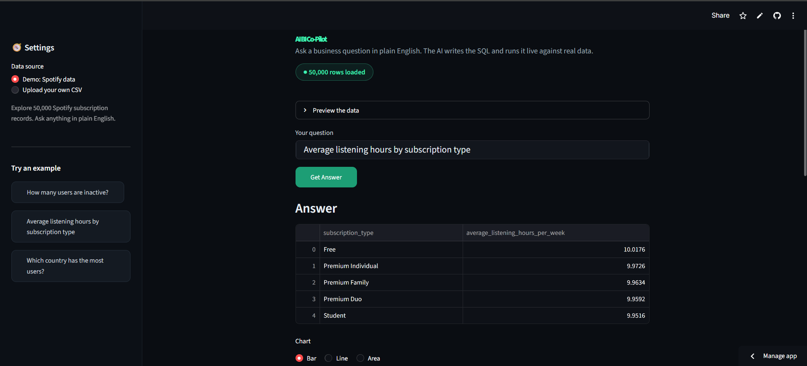

 

# AI BI Co-Pilot

Ask a business question in plain English. The AI writes the SQL, runs it against real data, and returns the answer with a chart.

## Live Demo

[Try it here](https://charulata-ai-copilot.streamlit.app/)

## What it does

You type a question like "how many users are inactive" or "average listening hours by subscription type." The tool sends your question to an AI model, which writes the SQL query, runs it against the dataset, and shows the result as a number, a table, or a chart.

No SQL knowledge needed to use it.

## Features

- Natural language to SQL using the OpenAI API
- Built-in demo dataset (50,000 Spotify subscription records)
- Upload your own CSV and query it the same way
- Automatic charts for grouped results (bar, line, area)
- Read-only safety guardrail that blocks any destructive query
- AI-generated follow-up question suggestions
- Case-insensitive, partial-match querying so questions rarely come back empty

## Built with

Python, OpenAI API, DuckDB, Streamlit, pandas

## How it works

The app takes a plain-English question and the dataset's column names, and asks the AI to write a single read-only SQL query. Before running anything, a safety check confirms the query is a SELECT and contains no destructive keywords. The query runs through DuckDB, and the result is displayed as a metric, table, or chart.

## Author

Charulata Ranbhare
